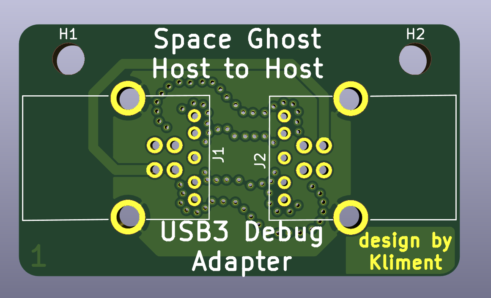
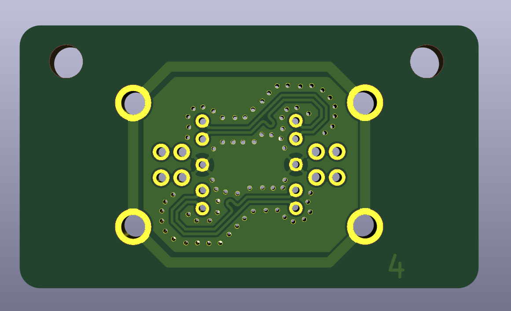

#Space Ghost Host to Host
This is a fun little adapter that converts 2x *USB3 A-B cables* to a USB3.0 specification section 5.5.2 compliant *host-host debug cable*.

#BOM

##Either:
`2x Pulse Electronic E8199-030-01 digikey PN 553-2263-ND`
##Or:
`2x XKB Enterprise U235-091N-4BLRC16-2-5 LCSC PN C388653`

#Images

#Manufacturing
Use the gerbers in the zip file. Designed to match JLC's JLC7628 stackup with 4 layers.
